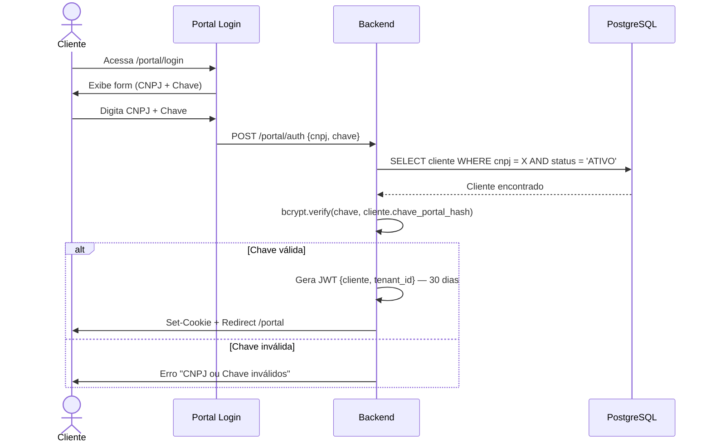

# Portal do Cliente — Login Direto (CNPJ + Chave de Acesso)

## Meta

Permitir que clientes acessem o portal **diretamente** (sem depender de emails) via **CNPJ + Chave de Acesso**, mantendo compatibilidade total com o fluxo de magic links existente.

---

## Contexto Atual

```
Email com documento → Botão "Acessar no Portal" → /acesso/{protocolo_id}
                                                       ↓
                                              JWT cookie (30 dias)
                                              {cliente, tenant_id}
                                                       ↓
                                              /portal (dashboard)
```

- Autenticação é **por empresa** (campo `cliente` = razão social)
- Múltiplas pessoas acessam com o mesmo cookie
- Se cookie expira → única opção é abrir email antigo
- Tela `/portal/login` atual é apenas um aviso de "sessão expirada"

---

## Solução: CNPJ + Chave de Acesso

```
Tela de Login → CNPJ + Chave → Valida no banco → JWT cookie (30 dias)
                                                       ↓
                                              /portal (dashboard)
```

### Fluxo Detalhado



### Coexistência com Magic Link

| Caminho | Quando acontece | Resultado |
|---|---|---|
| Magic link no email | Cliente clica no email | JWT criado via `/acesso/{id}` (sem mudanças) |
| Login direto | Cliente acessa `/portal/login` | JWT criado via `POST /portal/auth` |
| **Ambos produzem o mesmo JWT** | — | Sessão idêntica, mesma experiência |

---

## Tarefas

### Task 1: Adicionar campos ao model `Cliente`

**Arquivo:** [cliente.py](file:///g:/Meu%20Drive/JanioPontesSaas/app/models/cliente.py)

Adicionar 2 colunas:

```python
# Após a coluna 'nome_fantasia'
chave_portal_hash = Column(String(255), nullable=True, comment="Hash bcrypt da chave de acesso ao portal")
chave_portal_gerada_em = Column(DateTime(timezone=True), nullable=True, comment="Data de geração da última chave")
```

> **Verificar:** Model carrega sem erros, colunas documentadas.

---

### Task 2: Migration Alembic

**Comando:** `alembic revision --autogenerate -m "add_portal_access_key_and_login_attempts"`

Tabelas/Colunas:
- Tabela `clientes`: colunas `chave_portal_hash` (VARCHAR 255, nullable), `chave_portal_gerada_em` (TIMESTAMPTZ, nullable).
- Tabela `tentativas_login`: colunas `id` (UUID, primary key), `ip_address` (VARCHAR 45, index), `attempt_time` (TIMESTAMPTZ, default now), `documento` (VARCHAR 20, nullable).

> **Verificar:** `alembic upgrade head` executa sem erros no banco.

---

### Task 3: Endpoint de autenticação do portal

**Arquivo:** [portal.py](file:///g:/Meu%20Drive/JanioPontesSaas/app/routers/portal.py)

Nova rota `POST /portal/auth`:

```
Recebe: {documento: str, chave: str}
1. Normaliza e valida documento: remove caracteres não numéricos. Se len == 11, valida CPF; se len == 14, valida CNPJ.
2. Limpa tentativas expiradas (>15 min) e verifica rate limit no banco para o IP: se > 5 tentativas falhas, retorna HTTP 429.
3. Busca cliente por documento normalizado (bypass RLS) com status ATIVO. A comparação zera à esquerda (zfill 11 ou 14) para lidar com formatação inconsistente no DB.
4. Se não encontrar → registra tentativa falha e retorna erro genérico 401 "CNPJ/CPF ou Chave de Acesso inválidos".
5. bcrypt.verify(chave, cliente.chave_portal_hash).
6. Se inválido → registra tentativa falha e retorna erro genérico 401.
7. Se válido → remove histórico de falhas do IP, gera JWT {cliente: nome, tenant_id: id} (30 dias).
8. Set-Cookie __session (httponly, secure, samesite=lax, 30 dias) e Redirect → /portal.
```

**Segurança:**
- Rate limiting: persistido no banco na tabela `tentativas_login` (máx. 5 falhas por IP em 15 min).
- Mensagem de erro genérica.
- Log de tentativas falhas.

> **Verificar:** `POST /portal/auth` com credenciais corretas → redirect para `/portal`. Bloqueio após 5 falhas consecutivas do mesmo IP.

---

### Task 4: Redesign da tela `/portal/login`

**Arquivo:** [login.html](file:///g:/Meu%20Drive/JanioPontesSaas/app/templates/portal/login.html)

Transformar de "sessão expirada" para **tela de login funcional**:

```
┌──────────────────────────────────┐
│         [Logo JP]                │
│                                  │
│    Portal do Cliente             │
│                                  │
│  ┌────────────────────────────┐  │
│  │ CNPJ                      │  │
│  └────────────────────────────┘  │
│  ┌────────────────────────────┐  │
│  │ Chave de Acesso            │  │
│  └────────────────────────────┘  │
│                                  │
│  [ Entrar no Portal ]            │
│                                  │
│  ─────── ou ───────              │
│                                  │
│  💡 Você também pode acessar     │
│  pelo link no email recebido.    │
│                                  │
│  Precisa de ajuda? Fale conosco  │
└──────────────────────────────────┘
```

**Detalhes de UX:**
- Input CNPJ com máscara automática (`XX.XXX.XXX/XXXX-XX`)
- Input Chave com ícone de olho (show/hide)
- Feedback de erro inline (sem alert)
- Manter design system existente (Tailwind, Inter, cor `jp-navy`)
- Responsivo (mobile-first)

> **Verificar:** Tela renderiza, form submete via POST, máscara de CNPJ funciona, erros aparecem inline.

---

### Task 5: Geração e envio de chave (painel admin)

**Arquivo:** Router de clientes existente

Novo endpoint `POST /api/clientes/{id}/gerar-chave-portal`:

```
1. Gera chave aleatória legível: formato JP-XXXXXX (6 chars alfanum uppercase)
2. Faz hash bcrypt da chave
3. Salva hash + timestamp no cliente
4. Retorna a chave em texto puro (apenas nesta resposta, nunca mais)
5. Opcionalmente: envia email para TODOS os emails do cliente com a chave
```

**Emails destinatários (todos os cadastrados):**
Extrair de forma unificada e sem duplicidades (usando `set`):
- `cliente.email` (principal)
- `cliente.email_fiscal`
- `cliente.email_contabil`
- `cliente.email_pessoal`
- `cliente.email_societario`
- Emails de `cliente.regras_roteamento`: parsear JSON e extrair todos os valores string, separando por vírgula/ponto-e-vírgula se contiverem múltiplos e-mails.

**Template do email:**
```
Assunto: Sua Chave de Acesso ao Portal — Jânio Pontes

Prezado(a) [nome_cliente],

Segue sua chave de acesso ao Portal do Cliente:

    Chave: JP-XXXXXX

Para acessar:
1. Entre em app.janiopontes.com.br/portal/login
2. Digite seu CNPJ
3. Digite a chave acima

Esta chave é compartilhada entre todos os acessos da empresa.
Em caso de dúvida, entre em contato conosco.
```

> **Verificar:** Endpoint gera chave, hash salvo no banco, email enviado para todos os endereços cadastrados.

---

### Task 6: Botão no painel admin (UI interna)

**Arquivo:** Template de edição/detalhe do cliente (gestão interna)

Adicionar na tela de gestão do cliente:

- Botão **"Gerar Chave do Portal"** (com ícone de chave)
- Ao clicar: chama `POST /api/clientes/{id}/gerar-chave-portal`
- Modal de confirmação: "Isto irá gerar uma nova chave e enviar para todos os emails do cliente. A chave anterior será invalidada. Continuar?"
- Após sucesso: exibe a chave gerada em um card copiável + confirmação de envio
- Indicador visual: "Última chave gerada em: DD/MM/YYYY HH:MM" (ou "Nenhuma chave gerada")

> **Verificar:** Botão aparece, modal confirma, chave exibida após geração, timestamp atualiza.

---

### Task 7: Verificação final

- [ ] Login direto via CNPJ + Chave funciona e cria sessão idêntica ao magic link
- [ ] Magic link existente continua funcionando normalmente
- [ ] Tela de login responsiva e com design premium
- [ ] Chave regenerada invalida a anterior
- [ ] Rate limiting bloqueia após 5 tentativas
- [ ] Erro genérico não revela se CNPJ existe

---

## Segurança — Riscos e Mitigações

| Risco | Mitigação |
|---|---|
| Brute force na chave (6 chars) | Rate limit 5/15min por IP + formato `JP-` reduz guessing |
| Chave vazada externamente | Admin regenera em 1 clique; notificação por email |
| CNPJ é informação pública | Chave é o fator secreto; CNPJ sozinho não dá acesso |
| Conteúdo do portal é sensível? | Portal exibe documentos **já enviados por email** — risco baixo |
| Sem auditoria individual | Aceitável nesta fase; evolução futura possível (Caminho 3) |

### Sobre o tamanho da chave

`JP-XXXXXX` com 6 chars alfanuméricos uppercase = **36⁶ ≈ 2.18 bilhões** de combinações. Com rate limit de 5 tentativas/15min, brute force é inviável. Se desejar mais segurança futura, basta aumentar para 8 chars (36⁸ ≈ 2.8 trilhões).

---

## Arquivos Afetados (Resumo)

| Arquivo | Tipo de Alteração |
|---|---|
| `app/models/cliente.py` | +2 colunas |
| `alembic/versions/xxx_add_portal_key.py` | Nova migration |
| `app/routers/portal.py` | +1 rota POST, refactor login GET |
| `app/templates/portal/login.html` | Redesign completo |
| Router de clientes | +1 endpoint geração de chave |
| Template admin do cliente | +1 botão + modal |

---

## Evolução Futura (Fora deste escopo)

- **Caminho 3 (emails autorizados + OTP):** Pode ser adicionado depois como opção alternativa de login, sem conflitar com chave de acesso.
- **Auditoria individual:** Adicionar campo opcional "nome" na tela de login (após CNPJ + chave) para registrar quem acessou.
- **Geração em massa:** Botão "Gerar chaves para todos os clientes ativos" no painel admin.

---

## Notas

- A normalização de CNPJ deve tratar entradas com e sem máscara (`12.345.678/0001-99` e `12345678000199`).
- O campo `cnpj` no model `Cliente` já existe mas é nullable — considerar se há clientes sem CNPJ cadastrado e como tratar.
- O JWT gerado pelo login direto é **idêntico** ao do magic link, garantindo que todas as rotas do portal funcionem sem alteração.
